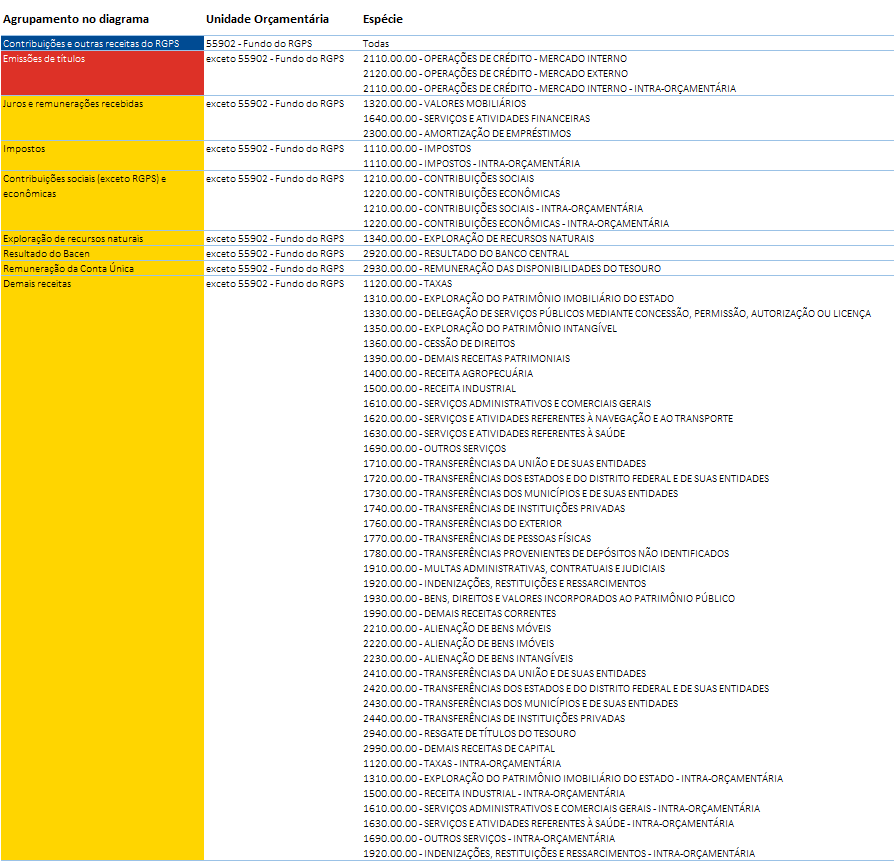

```{css, echo=FALSE}

h1,h2,h3,h4 {
  color: #004a93;
}

h2 {
  font-weight: bold;
}

blockquote {
  font-size: 12px;
  background-color: #edeff9; 
}

.destaques {
  padding: 1%;
  background-color: #eae6af;
}

.destaques ul {
  color: #004a93;
  list-style-type: none;
  padding: 0;
  margin: 0;
}

.destaques a {
  color: inherit;
  text-decoration: none;
}

.destaques p {
  padding: 1%;
}

.destaques p:hover{
  color: #eae6af;
  background-color: #004a93;
}
```

## Metodologia

Todas as receitas arrecadadas pelo Governo Federal passam por uma dupla classificação: 

* uma classificação por "natureza de receita", que procura identificar a origem do recursos, segundo o fato gerador (receitas de impostos, de contribuições para o INSS, de taxas, de aluguéis, de operações de crédito etc.); e

* uma classificação por "fonte/destinação" dos recursos, que procura agrupar e direcionar os recursos de acordo com as aplicações previstas na legislação (por exemplo, 18% da receita de impostos deve ser aplicada em Educação, os recursos das contribuições do INSS devem ser aplicados no pagamento de benefícios previdenciários etc.)

Além disso, no orçamento da União, cada despesa autorizada deve especificar justamente qual a origem do recurso que irá custeá-la. Isso é feito justamente por meio desse classificador "fonte/destinação de recursos". Como explica o [Manual Técnico de Orçamento de 2018 (MTO 2018)](http://www.planejamento.gov.br/assuntos/orcamento-1/informacoes-orcamentarias/arquivos/MTOs/mto_atual.pdf), da Secretaria de Orçamento Federal:

>A Fonte, nesse contexto, é instrumento de Gestão da Receita e da Despesa ao mesmo tempo, pois tem como objetivo assegurar que determinadas receitas sejam direcionadas para financiar atividades (despesas) do governo em conformidade com Leis que regem o tema.

Um exemplo prático pode ajudar a iluminar um pouco mais o assunto. Imagine que um cidadão pagou um <abbr title="Documento de Arrecadação de Receitas Federais">DARF</abbr> na rede bancária referente a imposto de renda apurado em sua declaração de ajuste anual. Esse DARF possui um código, o código de recolhimento 0211. Os recursos arrecadados serão classificados na natureza de receita correspondente ao Imposto de Renda Pessoa Física, e serão creditados na conta única do Tesouro. No entanto, o Governo não poderá aplicar esse dinheiro da forma que entender melhor: existem uma série de destinações dos recursos de impostos criadas pela legislação. Assim, esse recurso deverá ser destinado da seguinte forma:

* 0,6% ao Fundo Constitucional do Norte;
* 1,8% ao Fundo Constitucional do Nordeste;
* 0,6% ao Fundo Constitucional do Centro-Oeste;
* 24,5% ao Fundo de Participação dos Municípios;
* 21,5% ao Fundo de Participação dos Estados;
* 9,72% à Manutenção e Desenvolvimento do Ensino (são os 18% mencionados acima, porém esse percentual é aplicado ao que resta dos recursos arrecadados após a distribuição aos Fundos de Participação dos Municípios e dos Estados -- 46%);
* 41,28%, o restante, serão destinados de forma mais ou menos discricionária no Orçamento da União.

Para controlar todas essas destinações, o governo utiliza as tais "fontes/destinações de recursos".

Ou seja, as receitas orçamentárias arrecadadas são distribuídas em fontes de recursos, e os recursos das fontes de recursos são alocados às despesas orçamentárias.

Assim, embora não seja possível afirmar categoricamente que um determinado real pago por um cidadão a título de imposto de renda foi com certeza utilizado no pagamento de uma determinada despesa, sabemos que um percentual dos recursos arrecadados foram destinados a certas fontes, e sabemos os percentuais dessas fontes que foram destinadas a cada uma das despesas.

Dessa forma, analisando essas distribuições e calculando esses percentuais, podemos estimar então que um percentual de uma determinada receita foi destinada a uma determinada despesa. É o que fizemos aqui neste documento.

Os valores utilizados são aqueles da Lei Orçamentária Anual de 2018.

### Como as receitas foram classificadas

Existem diversas formas possíveis de se agruparem as receitas orçamentárias. Para este exercício, procuramos destacar certos agrupamentos de receitas, tais como as emissões de títulos públicos, as receitas do INSS, as receitas de impostos etc. 

A classificação por natureza de receitas utiliza uma estrutura de codificação baseada num código numérico de 8 dígitos, em que as posições dos dígitos constituem classificadores intermediários, da seguinte forma:


Para esta análise, as receitas foram agrupadas no seu terceiro nível, o nível de *Espécie*. Além disso, os recursos do Regime Geral de Previdência Social foram tratados de forma separada, por meio do classificador "unidade orçamentária".

Assim, as receitas foram agrupadas da seguinte forma:



### Como as despesas foram classificadas

Para as despesas, foi adotada uma classificação baseada naquela utiliza no capítulo "Estrutura do Gasto Público no Brasil", de autoria de Mansueto Almeida, do livro "A Reforma Esquecida", acrescentando-se as despesas da dívida pública e as transferências a estados e municípios. 

Essa classificação estabelece um recorte das despesas públicas da seguinte forma:


### Tratamento dos dados

```{r message=FALSE, warning=FALSE}
library(readxl)
library(tidyverse)
```


```{r message=FALSE, warning=FALSE}
rec <- read_excel("dados/Sankey Receitas por Fonte.xlsx", skip = 10)
des <- read_excel("dados/Sankey Despesas por Fonte.xlsx", skip = 10)

names(rec) <- c("nr", "fte", "fte_nome", "rec")
names(des) <- c("fte", "fte_nome", "nd", "des")

rec <- rec %>%
  group_by(nr) %>%
  mutate(rec = rec,  #/1000000
         subtot_rec = sum(rec),
         per_rec_fte = rec/sum(rec)) # calcula os % de distrib. de cada rec nas ftes

des <- des %>%
  group_by(fte) %>%
  mutate(des = des, #/1000000
         per_fte_des = des/sum(des)) # calcula os % de distrib. de fte nas desps

matriz <- rec %>%
  full_join(des)

# calcula o % de dist. de cada rec nas desps
# calcula então o tamanho de cada link, partir do subtotal de cada receita. ignorando se for menor que um bilhao
### a fazer: remover as linhas com um anti_join, para não contaminar a informação do hoover (outgoing, ingoing count)

matriz <- matriz %>% 
  mutate(p = per_rec_fte * per_fte_des, 
         # ramo = ifelse((round(subtot_rec * p,0)<1000000000),0,round(subtot_rec * p,0))) %>%
         ramo = round(subtot_rec * p,0)) %>% 
  group_by(nr,nd) %>%                        
  summarise(p = sum(p),
            ramo = sum(ramo)) %>%
  select(nr,nd,p,ramo)
```

```{r limpeza, message=FALSE, warning=FALSE}
tamanho_critico <- 500000000 
ramos_a_limpar <- matriz %>% filter(ramo<tamanho_critico) #fazer no shiny

matriz_original <- matriz

matriz <- matriz %>%
  anti_join(ramos_a_limpar)
```

```{r numera-nos, message=FALSE, warning=FALSE}
# relacao unica dos rotulos de receita e despesa:
rotulos <- c(unique(matriz$nr),unique(matriz$nd))

# conta os nós e gera sequencia numerica a partir de zero
num_nos <- length(rotulos)
nos <- 0:(num_nos-1)

# cria tabelinha para numerar os nos
tab_aux <- data.frame(rotulos, nos)

# incorpora os números dos nodes na matriz, para a receita... e para a despesa.
matriz <- matriz %>%
  left_join(tab_aux, by = c("nr" = "rotulos")) %>%   
  left_join(tab_aux, by = c("nd" = "rotulos"), suffix = c("_rec","_desp"))
  
```


```{r cores-e-fontes, message=FALSE, warning=FALSE}

# DEFINIÇÕES DAS CORES
library(RColorBrewer)

azul_STN <- "#004a93"
cor_divida_transluc <- "rgba(221, 49, 39,0.7)"
cor_RGPS_transluc <- "rgba(0,75,147,0.7)"
cor_divida <- "#dd3127"
cor_RGPS <- azul_STN
cor_padrao_despesas <- "#888888"

qde_rec_destacadas <- 2
qde_cores_extras <- length(unique(matriz$nr)) - qde_rec_destacadas

paleta_STN <- brewer.pal(qde_cores_extras, "Set2")
#paleta_STN <- c("#F8AC08","#CEC806","#96C11E","#028063","#149339","#4E857E","#6E287C")

paleta_STN_rgb <- col2rgb(paleta_STN)

# essa função gera uma matriz com os componentes RGB.
# precisamos fornecer as cores no formato "rgb(r,g,b)"
# além disso, para os ramos, é interessante que as cores sejam translúcidas, 
# então vamos acrescentar um componente de transparência

paleta_STN_transluc <- NULL
for (i in 1:dim(paleta_STN_rgb)[2] ) {
  paleta_STN_transluc <- c(paleta_STN_transluc, paste("rgba(", paleta_STN_rgb[1,i],", ",  paleta_STN_rgb[2,i],", ",  paleta_STN_rgb[3,i],", 0.7)", sep = ""))
}

# rotininha para povoar as cores dos ramos e dos nos, conforme as receitas

receitas <- unique(matriz$nr)

cores_ramos <- NULL
cores_nos <- NULL
k = 1

for (i in 1:length(receitas)) {
  if (receitas[i] == "Contribuições e outras receitas do RGPS") {
    cores_ramos <- c(cores_ramos, cor_RGPS_transluc)
    cores_nos <- c(cores_nos, cor_RGPS)
  }
  else if (receitas[i] == "Emissões de títulos") {
    cores_ramos <- c(cores_ramos, cor_divida_transluc)
    cores_nos <- c(cores_nos, cor_divida)
  }
  else {
    cores_ramos <- c(cores_ramos, paleta_STN_transluc[k])
    cores_nos <- c(cores_nos, paleta_STN[k])
    k <- k + 1 # o certo seria fazer algo modular, caso sejam mais receitas que cores
  }
}

## povoando as cores das despesas... (com um método mais elegante do que um loop)
despesas <- unique(matriz$nd)
cores_despesas <- rep(cor_padrao_despesas, length(despesas))

cores_despesas[despesas == "Amortização da Dívida" | despesas == "Juros"] <- cor_divida

cores_despesas[despesas == "Benefícios Previdenciários RGPS"] <- cor_RGPS

## fechando a lista de cores dos nos

cores_nos <- c(cores_nos, cores_despesas)

## tabelinha para usar de referência no preenchimento da matriz

tabelinha_cores_ramos <- data.frame(receitas, cores_ramos)

## preenchendo as cores dos ramos na matriz a partir dessa tabelinha

matriz <- matriz %>%
  left_join(tabelinha_cores_ramos, by = c("nr" = "receitas"))

```

```{r sem-divida, message=FALSE, warning=FALSE}
# qual o numero do no de juros
no_juros <- unique(matriz$nos_desp[which(matriz$nd=="Juros")])

# qual o numero do no de amortização da dívida
no_amort <- unique(matriz$nos_desp[which(matriz$nd=="Amortização da Dívida")])

matriz_semdivida <- matriz %>%
  mutate(nd = replace(nd, nd=="Juros", "Dívida"),
         nd = replace(nd, nd=="Amortização da Dívida", "Dívida"),
         nos_desp = replace(nos_desp, nd=="Dívida", min(no_juros,no_amort))) %>%
  filter(!(nr == "Emissões de títulos" & nd == "Dívida")) %>% # atenção a esse filtro!
  group_by(nr,nd,nos_rec,nos_desp,cores_ramos)%>%
  summarize(p = sum(p),
            ramo = sum(ramo))

rotulos_divida <- c(unique(matriz_semdivida$nr),unique(matriz_semdivida$nd))
```

## O diagrama: como são aplicadas as receitas federais?

```{r message=FALSE, warning=FALSE}
library(plotly)

p <- function(dados,nomes){
  plot_ly(
    type = "sankey",
    orientation = "h",
    opacity = 0.6, # será q isso controla a opacidade dos hovers??#,
    #valueformat = ">-.3~g",
    #valuesuffix = " bilhões de reais",

    textfont = list(
      family = "Source Sans Pro",
      color = "#444444",
      size = 12
    ),

    node = list(
      label = nomes,
      color = cores_nos,
      pad = 10,
      thickness = 25,
      line = list(
        color = "",
        width = 0
      )
    ),
    
    hoverlabel = list(
       font = list(
         family = "Source Sans Pro"
       )
     ),

    link = list(
      source = dados$nos_rec,
      target = dados$nos_desp,
      value =  dados$ramo,
      color = dados$cores_ramos
     #color =  "rgba(255,213,0,0.4)" # o pulo do gato! para deixar a cor translucida, é preciso usar rgba, e o último
                                     # parâmetro é a opacidade
      
      
    )
  ) %>% 
  layout(
    title = "",
    width = 700,
    height = 800,
    font = list(
      family = "Source Sans Pro",
      size = 11,
      color = "#004a93"
    )
)
}
```

### A versão completa

```{r message=FALSE, warning=FALSE}
p(matriz, rotulos)
```

### A versão sem o refinanciamento da dívida

Nesta versão, as operações da dívida estão restritas aos valores:

* das receitas de emissões destinadas a outras despesas; e

* dos pagamentos de dívida com recursos de outras receitas.

```{r message=FALSE, warning=FALSE}
p(matriz_semdivida,rotulos_divida)
```

